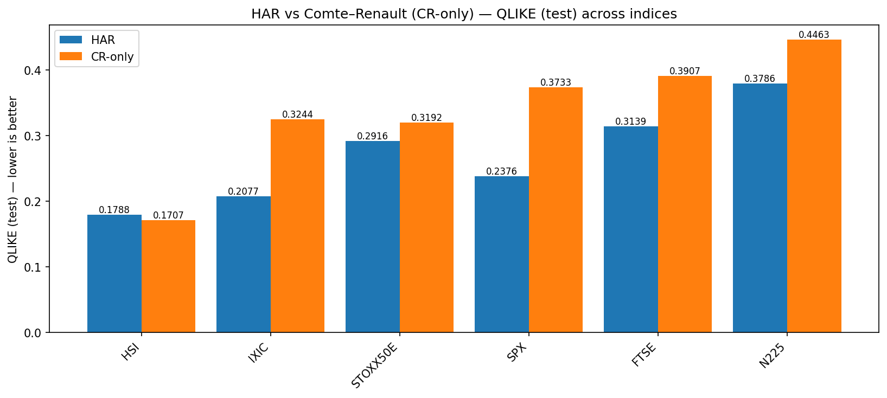
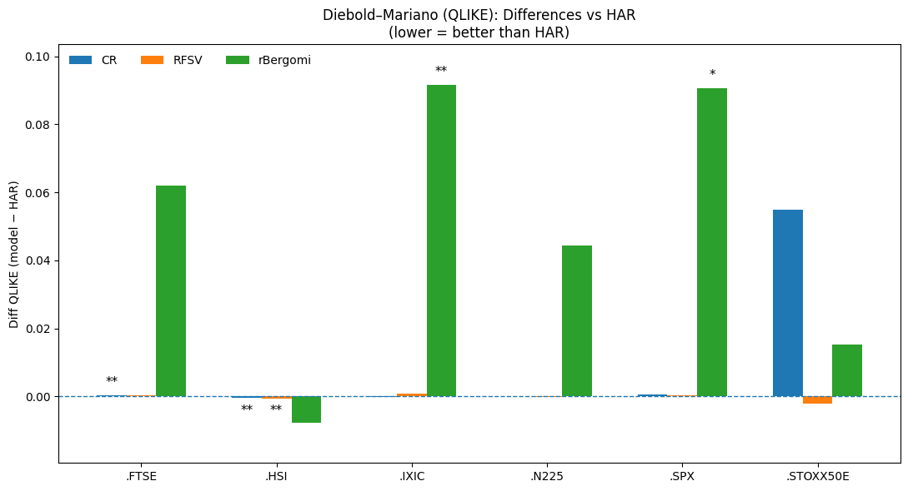
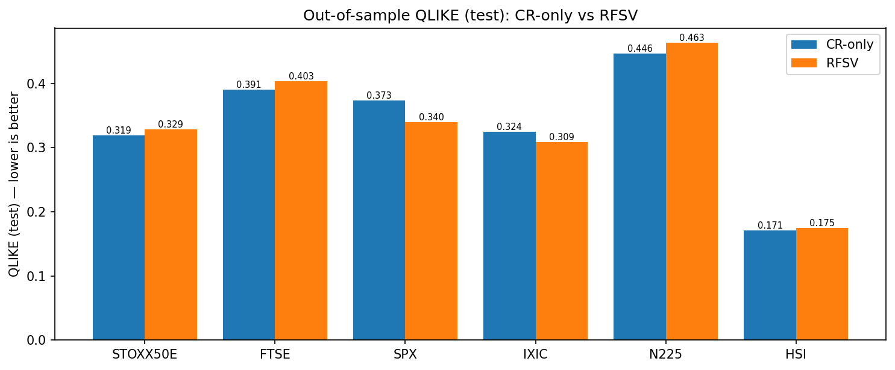

# From Fractional to Rough Volatility: Forecasting Performance of the Comte–Renault, RFSV and Rough Bergomi Models

**Master's Thesis – MSc Financial Risk and Data Analysis**
**Sapienza University of Rome**

This repository contains the thesis manuscript, presentation, and supporting material for a comparative study of fractional and rough volatility models for financial volatility forecasting.

---

## Research Question

Over the last decade, rough volatility has emerged as one of the most influential developments in quantitative finance. By introducing fractional dynamics and rough paths into volatility modelling, these frameworks have demonstrated a remarkable ability to reproduce several empirical features of financial markets.

However, an important practical question remains:

> **Does greater model sophistication lead to more accurate volatility forecasts?**

This thesis investigates that question through a comparative study of three volatility models:

* Comte–Renault
* Rough Fractional Stochastic Volatility (RFSV)
* Rough Bergomi

Their forecasting performance is evaluated against the HAR-RV benchmark, one of the most widely used and successful models in empirical volatility forecasting.

---

## Dataset

The empirical analysis is based on daily realized volatility data from the Oxford-Man Realized Library and covers six major equity indices:

* EURO STOXX 50
* FTSE 100
* S&P 500
* NASDAQ Composite
* Nikkei 225
* Hang Seng Index

The sample spans approximately two decades of market data and includes multiple market regimes, ranging from tranquil periods to episodes of severe financial stress.

---

## Methodology

The project combines concepts from:

* Volatility Forecasting
* Financial Econometrics
* Fractional Processes
* Rough Volatility Modelling
* Time Series Analysis

The empirical framework consists of:

1. Data preprocessing and feature construction.
2. HAR-RV benchmark implementation.
3. Estimation and calibration of the Comte–Renault, RFSV and Rough Bergomi models.
4. Hurst exponent estimation to assess the roughness of volatility.
5. One-day-ahead volatility forecasting.
6. Out-of-sample performance evaluation.

Forecasts are assessed using:

* QLIKE Loss
* Mean Squared Error (MSE) on log-volatility

and statistically validated through Diebold–Mariano tests.

---

## Key Findings

The empirical results reveal a striking contrast between theoretical sophistication and forecasting performance.

* All six indices exhibit rough volatility behaviour, with estimated Hurst exponents below 0.5.
* HAR-RV achieved the best overall out-of-sample forecasting performance in **5 out of 6** equity indices.
* The Hang Seng Index was the only market where the alternative models consistently outperformed the benchmark.
* Despite successfully capturing the rough nature of volatility, the RFSV and Rough Bergomi models did not deliver systematic forecasting improvements over HAR-RV at the daily frequency.
* Diebold–Mariano tests confirmed that forecasting gains were limited and market-dependent.

---

## Results Visualization

### HAR-RV vs Comte–Renault

Comparison of out-of-sample QLIKE losses between the HAR-RV benchmark and the Comte–Renault model across the six equity indices.

### Diebold–Mariano Test Results

Diebold–Mariano tests used to assess whether differences in forecasting performance are statistically significant.

### Comte–Renault vs RFSV

Comparison of out-of-sample QLIKE losses between the Comte–Renault and Rough Fractional Stochastic Volatility models.

---

## Main Conclusion

> **Greater mathematical sophistication does not automatically translate into superior forecasting performance.**

While all markets exhibit rough volatility characteristics, rough volatility models did not consistently outperform the simpler HAR-RV benchmark at the daily forecasting horizon.

This finding highlights the distinction between a model's ability to describe market dynamics and its ability to generate superior out-of-sample forecasts.

---

## Implementation

A substantial part of this project was devoted to implementation, calibration and empirical evaluation.

The work involved:

* HAR-RV implementation
* Comte–Renault implementation
* RFSV implementation
* Rough Bergomi implementation
* Hurst exponent estimation
* Model calibration and parameter selection
* Rolling-window forecasting analysis
* Statistical comparison through Diebold–Mariano tests

Particular attention was devoted to ensuring a fair and consistent out-of-sample comparison across all models.

---

## Repository Contents

* `TESI_ELISA.pdf` — Full Master's thesis
* `PRESENTATION.pdf` — Thesis presentation
* `Project_Overview.md` — Detailed discussion of the project and research process

Implementation notebooks, calibration procedures and additional empirical results will be added progressively.

---

## Future Work

The findings should be interpreted within the daily-frequency framework adopted in this thesis.

A natural extension of this research is the use of high-frequency intraday data, where roughness is expected to be more pronounced. Future work will investigate whether rough volatility models become more competitive when forecasting volatility at finer time scales.

Potential future developments include:

* Intraday realized volatility forecasting
* High-frequency financial data analysis
* Alternative rough volatility specifications
* Machine learning approaches to volatility forecasting
* Hybrid econometric–rough volatility models

---

## Author

**Elisa Battista**

MSc Financial Risk and Data Analysis
Sapienza University of Rome

### Research Interests

* Quantitative Finance
* Volatility Modelling
* Rough Volatility
* Financial Econometrics
* Time Series Analysis
* Forecasting

